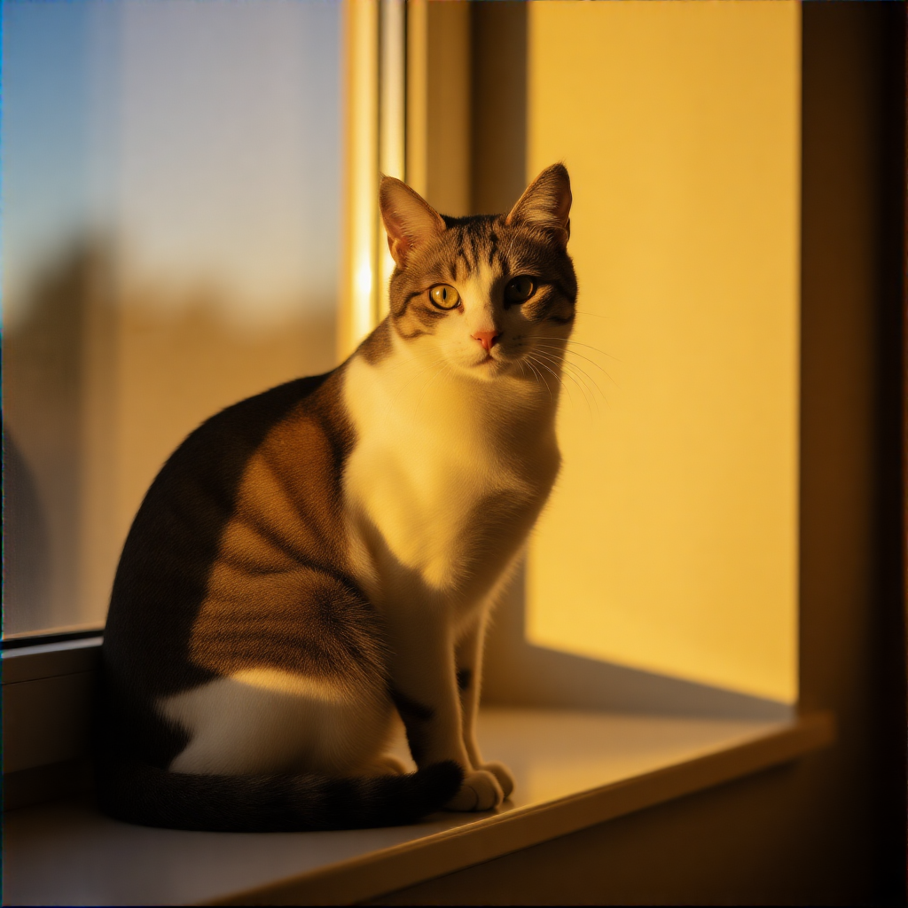
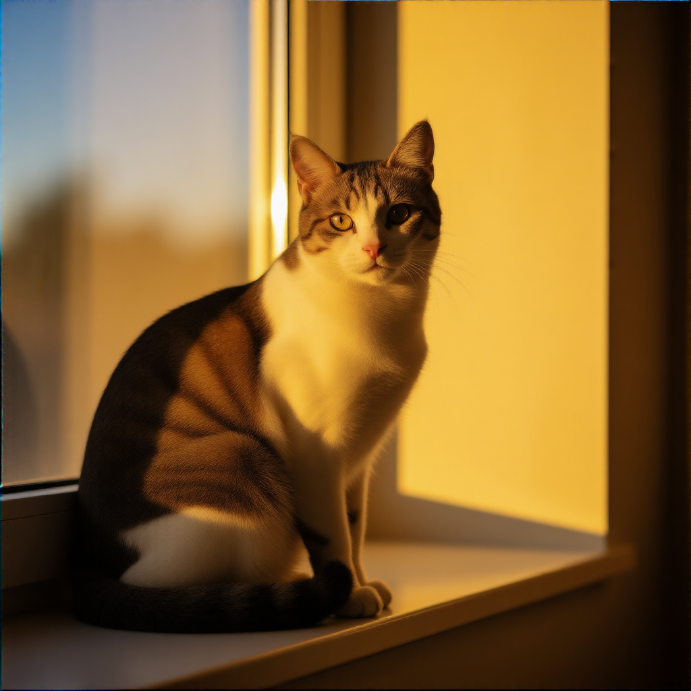
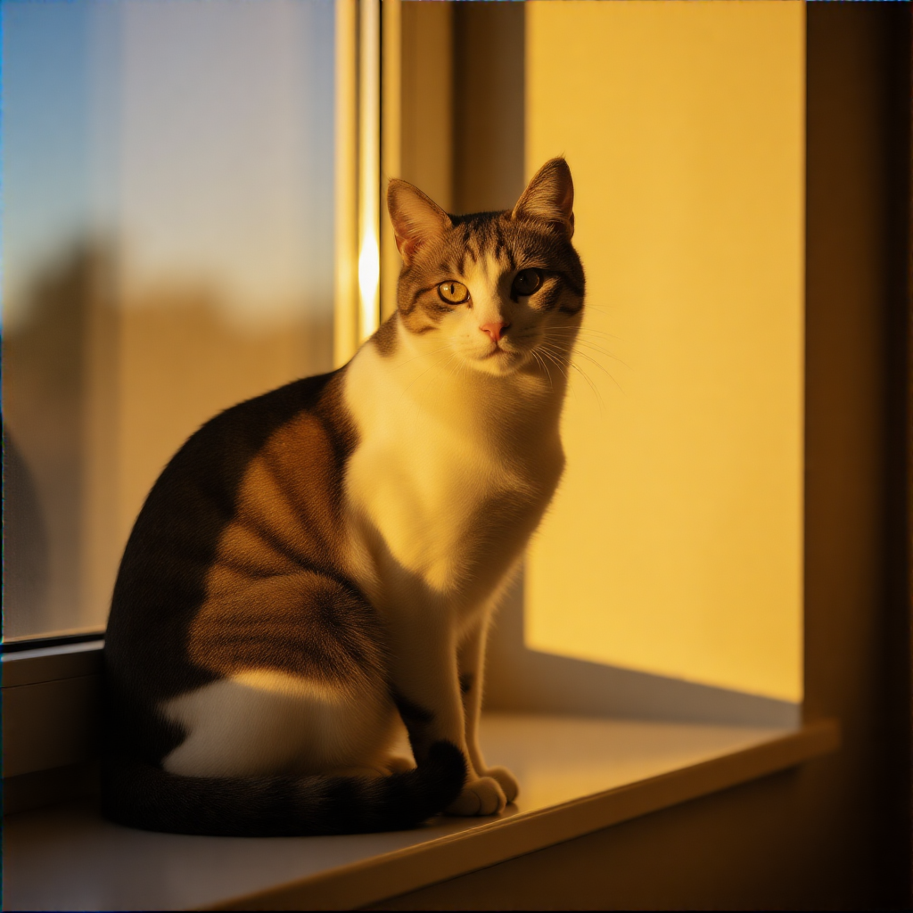

**English** | [한국어](BENCHMARK_KO.md)

# ZImage-Triton Benchmark Results

## Environment

| Item | Version |
|------|---------|
| GPU | NVIDIA GeForce RTX 5090 (32GB VRAM) |
| OS | WSL2 (Ubuntu 24.04, kernel 5.15.167.4-microsoft-standard-WSL2) |
| Python | 3.11.11 |
| PyTorch | 2.10.0+cu128 |
| Triton | 3.6.0 |
| ComfyUI | 0.16.4 |

## INT8 Quantization: W8A8 + Hadamard Rotation

ZImage-Triton uses **W8A8 quantization with Hadamard rotation** for INT8 acceleration.

- **W8A8**: Both weights and activations are quantized to INT8, utilizing INT8 Tensor Cores for ~1.5x faster GEMM operations
- **Hadamard Rotation**: Applies offline Hadamard rotation to weights before quantization, spreading outlier values evenly across channels. This preserves model quality while enabling aggressive quantization
- **Sensitive Layer Skip**: Embedding layers, AdaLN projections, and first/last transformer blocks are automatically excluded from quantization to maintain quality
- **VRAM Savings**: INT8 quantization replaces BF16 weights with INT8 + scales, reducing model VRAM from ~11.7GB to ~6.9GB (**-4.8GB**)
- **Custom ModelPatcher**: `ZImageTritonModelPatcher` keeps INT8 module weights on CPU during LoRA patching, preventing double-GPU memory usage and enabling full ControlNet coexistence without partial offload

## VRAM Usage

Measured with `nvidia-smi` during inference (RTX 5090, 1024x1024, Z-Image Base T2I).

| Variant | Total VRAM (nvidia-smi) | Transformer Only (ComfyUI log) |
|---------|:----------------------:|:-----------------------------:|
| Baseline (PyTorch BF16) | ~23.0 GB | ~11.7 GB |
| Triton Kernels | ~22.9 GB | ~11.7 GB |
| Triton + INT8 (Hadamard) | ~19.5 GB | ~6.9 GB |

> Total VRAM includes CLIP text encoder, VAE, CUDA context, and framework overhead (~11 GB).
> INT8 quantization saves **~3.5 GB total** (~4.8 GB on transformer weights alone).

---

## Z-Image Base (30 steps, CFG 4.0, 1024x1024)

### Text-to-Image

| Variant | E2E Time | Speedup |
|---------|----------|---------|
| Baseline (PyTorch BF16) | 18,950 ms | 1.00x |
| Triton Kernels | 17,970 ms | **1.05x** |
| Triton + INT8 (Hadamard) | 15,320 ms | **1.24x** |

<p float="left">



</p>

*Left: Baseline | Center: Triton | Right: Triton + INT8*

### Text-to-Image + LoRA (Famegrid)

LoRA: [Famegrid 2nd Gen](https://civitai.com/models/2088956) (strength: 0.8)

| Variant | E2E Time | Speedup |
|---------|----------|---------|
| Baseline (PyTorch BF16) | 18,980 ms | 1.00x |
| Triton Kernels | 17,100 ms | **1.11x** |
| Triton + INT8 (Hadamard) | 14,590 ms | **1.30x** |

<p float="left">


</p>

### Text-to-Image + Multi-LoRA (Famegrid + Flat Color)

LoRAs: [Famegrid 2nd Gen](https://civitai.com/models/2088956) (strength: 0.5) + [Flat Color](https://civitai.com/models/1132089) (strength: 0.7)

| Variant | E2E Time | Speedup |
|---------|----------|---------|
| Baseline (PyTorch BF16) | 18,070 ms | 1.00x |
| Triton Kernels | 16,690 ms | **1.08x** |
| Triton + INT8 (Hadamard) | 14,270 ms | **1.27x** |

<p float="left">


</p>

*Left: Baseline | Center: Triton | Right: Triton + INT8. INT8 mode applies LoRA only to sensitive layers (~20%), so styling effect is slightly weaker.*

### Base Summary

| Scenario | Baseline | Triton | Triton+INT8 | Triton Speedup | INT8 Speedup |
|----------|----------|--------|-------------|----------------|--------------|
| T2I | 18,950 ms | 17,970 ms | 15,320 ms | **1.05x** | **1.24x** |
| T2I + LoRA | 18,980 ms | 17,100 ms | 14,590 ms | **1.11x** | **1.30x** |
| T2I + Multi-LoRA | 18,070 ms | 16,690 ms | 14,270 ms | **1.08x** | **1.27x** |

---

## Z-Image Turbo (4 steps, CFG 1.0, 1024x1024)

### Text-to-Image

| Variant | E2E Time | Speedup |
|---------|----------|---------|
| Baseline (PyTorch BF16) | 1,610 ms | 1.00x |
| Triton Kernels | 1,600 ms | 1.01x |
| Triton + INT8 (Hadamard) | 1,410 ms | **1.14x** |

<p float="left">


</p>

*Left: Baseline | Center: Triton | Right: Triton + INT8*

### Text-to-Image + LoRA (Famegrid)

LoRA: [Famegrid 2nd Gen](https://civitai.com/models/2088956) (strength: 0.8)

| Variant | E2E Time | Speedup |
|---------|----------|---------|
| Baseline (PyTorch BF16) | 1,660 ms | 1.00x |
| Triton Kernels | 1,570 ms | **1.06x** |
| Triton + INT8 (Hadamard) | 1,370 ms | **1.21x** |

<p float="left">


</p>

### Text-to-Image + Multi-LoRA (Famegrid + Flat Color)

LoRAs: [Famegrid 2nd Gen](https://civitai.com/models/2088956) (strength: 0.5) + [Flat Color](https://civitai.com/models/1132089) (strength: 0.7)

| Variant | E2E Time | Speedup |
|---------|----------|---------|
| Baseline (PyTorch BF16) | 1,750 ms | 1.00x |
| Triton Kernels | 1,620 ms | **1.08x** |
| Triton + INT8 (Hadamard) | 1,270 ms | **1.38x** |

<p float="left">


</p>

*Left: Baseline | Center: Triton | Right: Triton + INT8. INT8 mode applies LoRA only to sensitive layers (~20%), so styling effect is slightly weaker.*

### Text-to-Image + ControlNet + LoRA

ControlNet: Z-Image-Turbo-Fun-Controlnet-Union (Canny mode)
LoRA: [Flat Color](https://civitai.com/models/1132089) (strength: 0.8)

| Variant | E2E Time | Speedup |
|---------|----------|---------|
| Baseline (PyTorch BF16) | 2,460 ms | 1.00x |
| Triton Kernels | 2,310 ms | 1.06x |
| Triton + INT8 (Hadamard) | 1,920 ms | **1.28x** |

<p float="left">


</p>

### Turbo Summary

| Scenario | Baseline | Triton | Triton+INT8 | Triton Speedup | INT8 Speedup |
|----------|----------|--------|-------------|----------------|--------------|
| T2I | 1,610 ms | 1,600 ms | 1,410 ms | 1.01x | **1.14x** |
| T2I + LoRA | 1,660 ms | 1,570 ms | 1,370 ms | **1.06x** | **1.21x** |
| T2I + Multi-LoRA | 1,750 ms | 1,620 ms | 1,270 ms | **1.08x** | **1.38x** |
| T2I + ControlNet + LoRA | 2,460 ms | 2,310 ms | 1,920 ms | **1.06x** | **1.28x** |

> With Turbo (4 steps), inference time is short (~1.6s), leading to higher run-to-run variance.
> INT8 provides consistent speedup across all scenarios, with larger gains in LoRA/ControlNet compound scenarios.

---

## How to Reproduce

```bash
# 1. Start ComfyUI
cd ComfyUI && python main.py --reserve-vram 5

# 2. Run benchmarks (5 repeats per workflow)
python benchmark/run_benchmark.py --repeats 5

# 3. Results
# Images:  benchmark/images/
# Data:    benchmark/benchmark_results.json
```

## LoRA Downloads

| LoRA | Source | Path |
|------|--------|------|
| Famegrid 2nd Gen | [Civitai](https://civitai.com/models/2088956) | `ComfyUI/models/loras/FameGrid_Revolution_ZIB_BOLD_.safetensors` |
| Flat Color (Z-Image Base) | [Civitai](https://civitai.com/models/1132089) | `ComfyUI/models/loras/zimagebase_flat_color_v2.1.safetensors` |
| Flat Color (Z-Image Turbo) | [Civitai](https://civitai.com/models/1132089) | `ComfyUI/models/loras/zimage_flat_color_v2.1.safetensors` |

## Methodology

- **Repeats**: 5 runs per workflow
- **Steady-state**: Mean of runs 2-5 (first cold run excluded). When run 2 has a cold-start spike (>1.3x of runs 3-5 mean), runs 3-5 mean is used instead
- **Seed**: Varied per repeat (`seed + i + 1`) to defeat ComfyUI node caching
- **Execution**: Sequential within model group (Base 9, Turbo 12), VRAM freed between groups
- **Warmup**: First workflow file per model group used for warmup before timed runs
- **Measurement**: Wall-clock time from prompt submission to completion
